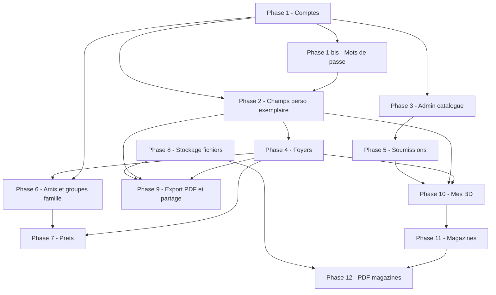
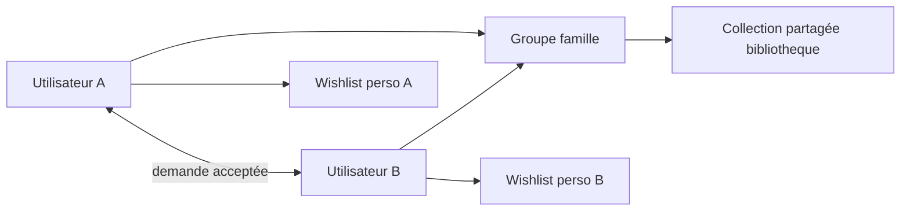

# Roadmap Moncine

Document de planification des **évolutions fonctionnelles** de l’application Moncine (dvdthèque personnelle : films, bandes dessinées, puis magazines).

Les phases sont **ordonnées par dépendances** : chaque étape s’appuie sur la précédente. Les changements de base de données passent par des **migrations SQL numérotées**, testées depuis la version précédente.

---

## Vision cible

| Acteur | Capacités |
|--------|-----------|
| **Administrateur** | Gère le **catalogue** d’œuvres partagé, valide les propositions, enrichit les fiches via TMDB — **ne gère plus les foyers** (phase 6) |
| **Utilisateur** | **Amis**, création de **groupes famille** avec d’autres amis, bibliothèque partagée du groupe, **sa** wishlist, **ses** notes et visions ; prêts |
| **Membre d’un groupe « famille »** | Même collection physique que le groupe ; wishlist et historique **personnels** (comme aujourd’hui avec le foyer v0.7) |
| **Tous** | Ne modifient pas les métadonnées catalogue — seulement les infos de **leur** exemplaire (`support`, format image/son, etc.) |

Fonctionnalités métier visées :

1. Comptes **admin** / **utilisateur** (connexion, gestion des comptes, changement et réinitialisation de mot de passe)
2. **Réseau d’amis** (demandes, acceptation) — **socle** du système social
3. **Groupes « famille » / foyer** : créés **par les utilisateurs** (amis qui s’associent), avec bibliothèque partagée — **remplace** la gestion admin des foyers (phase 4)
4. **Prêts** : savoir quoi a été prêté, à qui, quand, et le retour
5. **Stockage de fichiers** volumineux (PDF magazines, etc.) : dossier partagé type YunoHost + option **stockage objet S3**
6. **Export PDF** de la bibliothèque / des envies + **accès visiteur** par URL partagée (lecture seule)
7. Page **Mes BD** (collection + wishlist)
8. ~~**Soumissions** au catalogue~~ — **livré v0.7.4** (propositions, validation admin, notifications)
9. **Collections de magazines** (titres, numéros, organisation par collection)
10. **Magazines en PDF** + **lecteur PDF** (s’appuie sur la couche stockage)

---

## État actuel

**Version applicative : 0.7.8**

Application PHP + SQLite, déployable en local ou sur un serveur web classique.

### Déjà en place

| Domaine | Contenu |
|---------|---------|
| **Catalogue & bibliothèque** | Tables `oeuvres`, `bibliotheque`, `historique` ; films, envies, import/export CSV |
| **Enrichissement** | TMDB, OMDB, affiches, statistiques, quiz, sagas |
| **Comptes (phase 1)** | Connexion, déconnexion, premier admin, CRUD utilisateurs, rôles, protection des pages |
| **Mots de passe (phase 1 bis)** | Mon compte, changement de mot de passe, oublié par e-mail, reset admin |
| **Exemplaire personnel (phase 2)** | `format_image` / `format_son` sur `bibliotheque` ; formulaire « mon exemplaire » ; enrichissement catalogue réservé admin |
| **Admin catalogue (phase 3)** | Liste, fiche œuvre, maintenance, affiche manuelle |
| **Foyers (phase 4)** | Collection partagée, envies / historique personnels |
| **Profil (v0.7.2)** | Prénom, pseudo, menu Paramètres / Gestion, navigation fiches |
| **Soumissions catalogue (phase 5, v0.7.4)** | Proposer, valider, refuser ; notifications in-app + e-mail |
| **Profil & recherche (v0.7.6)** | Ville optionnelle, recherche par pseudo/ville, opt-out recherche, cloche compacte |
| **Amis & groupes famille (phase 6, v0.7.7)** | Demandes d’ami, groupe famille utilisateur, invitations, admin foyers lecture seule |
| **Envies groupe & UX (v0.7.8)** | Envies agrégées du groupe, votes « Moi aussi », ajout direct après proposition acceptée |
| **Migrations SQL** | `SchemaMigrator`, CLI `php lib/cli/migrate.php`, migrations `001` → `016` |
| **Tests** | PHPUnit (import, catalogue, foyers, soumissions, notifications) |

### Point d’étape — mai 2026

**Version actuelle : 0.7.8.** Phase 6 (amis & groupes) livrée en v0.7.7 ; envies du groupe et UX ajout rapide en v0.7.8. Prochaine évolution : **phase 7** (prêts).

| Version | Contenu principal |
|---------|-------------------|
| 0.7.0 | Foyers & collection partagée |
| 0.7.1 | Affiche manuelle admin (catalogue) |
| 0.7.2 | Profil, menus, navigation Préc./Suiv. entre fiches |
| 0.7.4 | Soumissions catalogue + notifications + UX catalogue |
| 0.7.6 | Ville, recherche utilisateurs, opt-out recherche, cloche notifications |
| 0.7.7 | Amis, groupes famille, invitations, admin foyers lecture seule |
| 0.7.8 | Envies du groupe, notifications proposition acceptée, ajout en un clic |

### Prochaines étapes

| Phase | Statut |
|-------|--------|
| Phase 3 — Admin catalogue | ✅ Livré (v0.6) |
| Phase 4 — Foyers & famille | ✅ Livré (v0.7) |
| Phase 5 — Soumissions catalogue | ✅ Livré (v0.7.4) |
| Pré-phase 6 — Profil ville & recherche utilisateurs | ✅ Livré (v0.7.6) |
| Phase 6 — Amis & groupes famille (foyers utilisateurs) | ✅ Livré (v0.7.7) |
| Phase 7 — Prêts entre utilisateurs | **Prochaine** |
| Phase 8 — Stockage fichiers (local + S3) | À faire |
| Phase 9 — Export PDF & partage visiteur | À faire |
| Phase 10 — Mes BD | À faire |
| Phase 11 — Collections de magazines | À faire |
| Phase 12 — Magazines PDF & lecteur | À faire |

---

## Vue d’ensemble des phases



---

## Stratégie SQL : migrations versionnées

### Suivi du schéma

```sql
schema_migrations (name TEXT PRIMARY KEY, applied_at)

app_metadata (
  key TEXT PRIMARY KEY,
  value TEXT NOT NULL
)
-- Clés : schema_version, …
```

- **`schema_version`** : numéro de la dernière migration appliquée
- **`schema_migrations`** : traçabilité fichier par fichier

### Convention

| Règle | Exemple |
|-------|---------|
| Nom de fichier | `007_admin_audit_log.sql`, `008_foyers.sql` |
| Numéro sur 3 chiffres, croissant | Ne jamais modifier un fichier déjà publié |
| Une responsabilité par fichier | Auth ≠ foyers ≠ BD |
| SQL + commentaire en tête | `-- requires: schema_version >= 6` |
| Données : `INSERT…SELECT` explicite | Pour les transformations de données existantes |

### Schéma cible (après toutes les phases)

```text
oeuvres              -- catalogue partagé (films, BD, magazines, …)
bibliotheque         -- lien foyer/user + statut + champs perso exemplaire
historique           -- visions + notes (+ user_id)
utilisateurs         -- comptes (role ; lien groupe via group_members)
foyers               -- groupes « famille » (type famille), créés par les utilisateurs (phase 6)
group_members        -- appartenance user ↔ groupe (rôle fondateur / membre)
friendships          -- liens amis (prérequis pour créer ou rejoindre un groupe)
catalogue_soumissions
notifications          -- alertes in-app (soumissions catalogue, etc.)
loans                -- prêts d’exemplaires (phase 7)
stored_objects       -- métadonnées fichiers (chemin local ou clé S3) (phase 8)
share_links          -- jetons URL partagée lecture seule (phase 9)
magazine_collections -- titres / séries de magazines (phase 11)
magazine_numeros     -- numéros rattachés à une collection (phase 11)
magazine_fichiers    -- lien vers stored_objects (phase 12)
schema_migrations
app_metadata
sessions             -- si sessions en base
```

### Outils

| Élément | Rôle |
|---------|------|
| `sql/schema.sql` | Install fraîche (base vide) |
| `sql/migrations/*.sql` | Évolutions incrémentales |
| `php lib/cli/migrate.php` | Appliquer les migrations (dev et production) |

---

## Phase 1 — Comptes, connexion et rôles ✅

**Objectif :** fin du mono-utilisateur ; base pour familles et soumissions.

**Statut : livré** (migration `002_utilisateurs_auth.sql`).

| # | Tâche | Statut |
|---|--------|--------|
| 1.1 | Connexion / déconnexion | ✅ |
| 1.2 | `UserContext` ← session | ✅ |
| 1.3 | Protection pages + menu par rôle | ✅ |
| 1.4 | Assistant premier admin (DB vide) | ✅ |
| 1.5 | CRUD utilisateurs (admin) | ✅ |
| 1.6 | `canManageCatalog()` ← `role` | ✅ |
| 1.7 | Durcissement sécurité (CSRF, limite connexion, hash) | ✅ |

**Critère :** deux comptes → deux bibliothèques distinctes.

---

## Phase 1 bis — Mots de passe ✅

**Objectif :** chaque utilisateur gère son mot de passe ; récupération en cas d’oubli.

**Statut : livré** (migration `004_password_reset_tokens.sql`).

| # | Tâche | Statut |
|---|--------|--------|
| 1 bis.1 | Page Mon compte (profil) | ✅ |
| 1 bis.2 | Changer son mot de passe | ✅ |
| 1 bis.3 | Admin : réinitialiser le mot de passe d’un compte | ✅ |
| 1 bis.4 | Mot de passe oublié (formulaire e-mail) | ✅ |
| 1 bis.5 | Nouveau mot de passe via jeton (expiration, usage unique) | ✅ |
| 1 bis.6 | Envoi e-mail (SMTP ou `mail()`) | ✅ |
| 1 bis.7 | Limite de débit sur « oublié » | ✅ |

### Hors scope court terme

| Idée | Phase suggérée |
|------|----------------|
| Forcer changement au premier login | 1 bis.9 |
| Authentification à deux facteurs (2FA) | Hors périmètre |
| SSO / LDAP | Phase ultérieure (optionnelle) |

---

## Phase 2 — Catalogue vs exemplaire personnel ✅

**Objectif :** séparer les métadonnées catalogue (partagées) des infos de l’exemplaire personnel (support, formats).

**Statut : livré** (migrations `005_format_exemplaire_bibliotheque.sql`, `006_drop_oeuvre_format_columns.sql`).

| # | Tâche | Statut |
|---|--------|--------|
| 2.1 | `format_image`, `format_son` sur `bibliotheque` | ✅ |
| 2.2 | Formulaires utilisateur : champs exemplaire uniquement | ✅ |
| 2.3 | Blocage serveur : pas de modification catalogue par un user | ✅ |
| 2.4 | Enrichissement TMDB réservé admin | ✅ |
| 2.5 | Migration des données existantes | ✅ |

**Critère :** l’utilisateur modifie support/format ; pas le titre catalogue.

---

## Phase 3 — Admin catalogue ✅

**Objectif :** outils de maintenance du catalogue pour les administrateurs.

**Statut : livré** (v0.6.0, migration `007_admin_audit_log.sql`).

| # | Tâche | Statut |
|---|--------|--------|
| 3.1 | Page admin : vue d’ensemble (doublons, fiches incomplètes) | ✅ |
| 3.2 | Fusion de doublons (`oeuvres` → une seule fiche) | ✅ |
| 3.3 | Journal des actions admin sur le catalogue | ✅ |
| 3.4 | Outils de nettoyage (affiches orphelines, doublons TMDB) | ✅ |

Page : `/maintenance-catalogue.php` (menu admin **Maintenance**).

**Critère :** un admin peut détecter et fusionner un doublon sans perte de bibliothèque utilisateur.

---

## Phase 4 — Foyers & famille ✅

**Objectif :** collection partagée au niveau du foyer ; wishlist et historique personnels.

**Statut : livré** (v0.7.0, migrations `008`–`011`, script `FoyerMigration`).

**Dépend de :** phase 2. **Migration la plus délicate** — prévoir sauvegarde avant upgrade.

### Migrations SQL

```text
008_foyers.sql — table foyers, foyer_id sur utilisateurs
009_bibliotheque_foyer_collection.sql — foyer_id sur collection
010_historique_user_id.sql — user_id sur historique
011_wishlist_per_user.sql — contraintes collection (foyer) / envies (user)
```

Script PHP post-SQL : `lib/FoyerMigration.php`.

| # | Tâche | Statut |
|---|--------|--------|
| 4.1 | CRUD foyers (admin) | ✅ |
| 4.2 | Affectation utilisateur → foyer | ✅ |
| 4.3 | Collection visible par tous les membres du foyer | ✅ |
| 4.4 | Wishlist et historique filtrés par `user_id` | ✅ |
| 4.5 | Interface « famille » (sous-comptes, affectation foyer) | ✅ |

Pages : `/foyers.php`, `/utilisateurs.php`, `/mon-compte.php`.

**Critère terminé :** deux membres d’un même foyer voient la même collection ; leurs envies et notes restent séparées.

> **Évolution prévue (phase 6)** : le modèle ci-dessus reste **valide techniquement** (tables `foyers`, `foyer_id`, collection partagée), mais la **gouvernance** change. L’admin ne crée plus les foyers : des **amis** créent ensemble un **groupe famille** qui reprend les mêmes droits (bibliothèque commune, envies perso). Les foyers v0.7 seront **migrés** vers ce modèle ; `/foyers.php` admin sera retiré ou remplacé par une gestion côté utilisateur.

---

## Phase 5 — Soumissions catalogue ✅

**Objectif :** les utilisateurs proposent de nouvelles œuvres ; l’admin valide avant insertion dans `oeuvres`.

**Statut : livré** (v0.7.4, migration `013_catalogue_soumissions.sql`).

**Dépend de :** phase 3 (recommandé) ou phase 1 (minimum).

### Migrations SQL livrées

```text
012_utilisateur_profil.sql   -- prénom, pseudo (v0.7.2)
013_catalogue_soumissions.sql
014_notifications.sql
```

| # | Tâche |
|---|--------|
| 5.1 | Formulaire « proposer une œuvre » (TMDB optionnel, autocomplétion) | ✅ |
| 5.2 | File d’attente admin (approuver / rejeter / modifier la fiche) | ✅ |
| 5.3 | Notification admin (nouvelle proposition) et utilisateur (acceptée / refusée), in-app + e-mail | ✅ |
| 5.4 | Aucune écriture directe dans `oeuvres` par un utilisateur non admin | ✅ |
| 5.5 | Menus : Paramètres (Compte, Proposer, Importer) ; Gestion admin ; pas de « Proposer » pour l’admin | ✅ |
| 5.6 | Navigation Préc./Suiv. (fiches film, fiches catalogue, pagination liste catalogue) | ✅ |

Pages : `/proposer-oeuvre.php`, `/mes-soumissions.php`, `/soumissions-catalogue.php`, `/notifications.php`.

**Critère terminé :** une proposition validée apparaît dans le catalogue ; une rejetée ne laisse aucune trace dans `oeuvres` ; les parties concernées sont notifiées.

> **Après migration :** `php lib/cli/migrate.php` (applique `013` et `014` si besoin).

---

## Phase 6 — Amis & groupes « famille » (nouveau modèle de foyer)

**Objectif :** le **réseau d’amis** devient le socle social. Le **foyer** n’est plus un objet créé par l’**admin** : c’est un **groupe d’amis** de type **famille** (ou **foyer**), que **deux utilisateurs amis** (ou plus) **créent ensemble** et auquel ils invitent d’autres amis. Ce groupe conserve tout ce que fait le foyer actuel : **bibliothèque partagée**, envies et historique **personnels** par membre.

**Dépend de :** phases 1 et 4 (comptes + modèle collection partagée déjà en place — à faire évoluer).

### Principe (remplace la gestion admin des foyers)

| Avant (v0.7, phase 4) | Après (phase 6) |
|------------------------|-----------------|
| L’admin crée un foyer et affecte les utilisateurs | Deux **amis** créent ensemble un groupe **famille** |
| `/foyers.php` réservé admin | **Mes groupes** / **Créer un groupe famille** côté utilisateur |
| `utilisateurs.foyer_id` imposé par admin | Appartenance via **group_members** ; un user peut appartenir à un groupe (règle à préciser : un seul groupe famille actif ou plusieurs — v1 : **un groupe famille principal**) |
| Amis et foyers séparés | **Amis d’abord** → puis groupe famille = ancien « foyer » |



### Migrations SQL prévues

```text
016_friendships_and_groups.sql
  - friendships (requester_id, addressee_id, status pending|accepted|blocked, …)
  - foyers : kind = 'famille' | …, created_by_user_id, created_at
  - group_members (foyer_id, user_id, role founder|member, joined_at, invited_by)
  - migration données : chaque foyer v0.7 → groupe famille + membres existants
  - utilisateurs : foyer_id conservé comme groupe actif ou dérivé de group_members
```

> Le nom de table **`foyers`** peut être conservé en base pour limiter la casse (migrations 008–011), mais l’**interface** et les **droits** parlent de **groupe famille**.

### Tâches

| # | Tâche |
|---|--------|
| 6.1 | **Demandes d’ami** : envoyer / accepter / refuser (+ notifications) | ✅ |
| 6.2 | Page **Mes amis** (liste, demandes en attente) | ✅ |
| 6.3 | **Créer un groupe famille** (nom, un groupe actif par utilisateur) | ✅ |
| 6.4 | **Inviter un ami** dans le groupe (invitation acceptée par l’invité) | ✅ |
| 6.5 | **Quitter le groupe** / transfert du rôle fondateur (v1 minimal) | ✅ |
| 6.6 | **Bibliothèque partagée** : `bibliotheque.foyer_id` du groupe | ✅ |
| 6.7 | **Migration v0.7** : foyers → groupes + `group_members` | ✅ |
| 6.8 | **Retrait admin** : `/foyers.php` lecture seule ; comptes sans affectation foyer | ✅ |
| 6.9 | Visibilité profil / wishlist ami | — (phase ultérieure) |
| 6.10 | Modération admin signalement / blocage | — (phase ultérieure) |

**Critère terminé :** Alice et Bob sont amis ; ils créent ensemble le groupe « Famille Martin » ; leur collection DVD est commune ; leurs envies restent séparées ; l’admin ne crée plus de foyer depuis l’interface Gestion.

### Ce qui ne change pas (héritage phase 4)

- Collection = lignes `bibliotheque` liées au **groupe** (`foyer_id`).
- Envies et historique = **par utilisateur** (`user_id`).
- Sous-comptes « famille » sans e-mail propre : à redéfinir (compte enfant rattaché à un adulte du groupe — phase ultérieure ou règle v1 simplifiée).

### Points d’attention (phase 6)

- **Utilisateur sans groupe** : bibliothèque personnelle seule jusqu’à création ou invitation dans un groupe famille.
- **Un ou plusieurs groupes** : v1 recommandé = **un groupe famille actif** par utilisateur pour éviter la confusion des collections.
- **Compatibilité** : sauvegarde obligatoire avant migration ; script de reprise des foyers admin existants.

---

## Phase 7 — Prêts entre utilisateurs

**Objectif :** suivre ce qui a été **prêté** (DVD, BD, magazine…), **à qui**, **quand**, et le **retour** — à un ami Moncine ou à une personne externe (nom libre).

**Dépend de :** phases 4 et 6 (recommandé).

### Migrations SQL prévues

```text
015_loans.sql
  - loans (bibliotheque_id, lender_user_id, borrower_user_id NULL,
    borrower_name TEXT, loaned_at, due_at, returned_at, note)
```

| # | Tâche |
|---|--------|
| 7.1 | Marquer un exemplaire comme **prêté** (date de départ) |
| 7.2 | Bénéficiaire : utilisateur **ami** ou **nom libre** |
| 7.3 | Date de retour prévue et **retour effectif** |
| 7.4 | Vues **Prêts en cours** / **Historique** |
| 7.5 | Indicateur sur la fiche (« prêté à … ») |
| 7.6 | Rappels d’échéance — optionnel v1 |

**Critère terminé :** les exemplaires prêtés sont identifiables ; un retour remet l’exemplaire en disponible.

---

## Phase 8 — Stockage de fichiers (dossier partagé & S3)

**Objectif :** stocker les **fichiers volumineux** (PDF magazines, etc.) hors `www/`, avec un dossier personnalisable type **YunoHost** et une option **stockage objet S3** (MinIO, Scaleway, AWS, B2…) pour des volumes économiques.

**Dépend de :** phase 1 (configuration instance). **Prérequis** pour la phase 12 (PDF magazines).

### Configuration cible (exemple YunoHost)

```text
/home/yunohost.multimedia/share/moncine/
  ├── objects/     # PDF et binaires
  ├── posters/     # affiches (migration possible)
  └── exports/     # PDF générés
```

| Variable | Exemple | Rôle |
|----------|---------|------|
| `MONCINE_DATA_PATH` | `…/data` | SQLite, clés API |
| `MONCINE_MEDIA_PATH` | `/home/yunohost.multimedia/share/moncine` | Racine médias |
| `MONCINE_STORAGE_BACKEND` | `local` ou `s3` | Moteur |
| `MONCINE_S3_*` | endpoint, bucket, clés | Si S3 |

### Migrations SQL prévues

```text
016_stored_objects.sql
  - stored_objects (backend local|s3, path_or_key, mime, size_bytes, checksum, …)
  - app_metadata : chemins et mode de stockage
```

| # | Tâche |
|---|--------|
| 8.1 | Interface **`ObjectStorage`** (put, get, delete, stream) |
| 8.2 | Backend **filesystem local** (`MONCINE_MEDIA_PATH`) |
| 8.3 | Backend **S3-compatible** |
| 8.4 | Config admin : local vs S3, test de connexion |
| 8.5 | Doc déploiement YunoHost (droits, backup du share) |
| 8.6 | Lecture des fichiers **via PHP** (pas d’URL publique directe) |

**Critère terminé :** dossier share ou bucket S3 configurable ; le code métier ne dépend plus d’un chemin fixe sous `www/`.

### Points d’attention (phase 8)

- **Coût** : S3 économique en volume ; lifecycle pour archives froides.
- **Backup** : inclure share local et bucket dans la stratégie de sauvegarde.

---

## Phase 9 — Export PDF & partage visiteur

**Objectif :** permettre d’**exporter en PDF** la bibliothèque et la wishlist depuis leurs pages respectives, et d’ouvrir une **vue visiteur** en lecture seule via une **URL partagée** (sans connexion, sans aucune modification possible).

**Dépend de :** phases 2 et 4 (collection foyer + wishlist personnelle déjà en place).

### Migrations SQL prévues

```text
017_share_links.sql
  - share_links (token_hash, scope collection|wishlist, foyer_id ou user_id,
    label optionnel, expires_at, revoked_at, created_by)
```

> L’export PDF peut s’appuyer sur les données existantes (pas de table dédiée obligatoire).

| # | Tâche |
|---|--------|
| 9.1 | **Export PDF** depuis **Mes films** : liste de la collection du foyer (filtres / tri courants reflétés dans le document) |
| 9.2 | **Export PDF** depuis **Mes envies** : liste de la wishlist de l’utilisateur connecté |
| 9.3 | Mise en page PDF lisible (titres, années, réalisateurs, affiches optionnelles en miniature) |
| 9.4 | Lien partagé **bibliothèque** : URL publique `/partage/…` → vue lecture seule de la collection du foyer |
| 9.5 | Lien partagé **wishlist** : URL publique → vue lecture seule de la wishlist de l’utilisateur qui a généré le lien |
| 9.6 | Gestion des liens : créer, copier, révoquer, expiration optionnelle (page Paramètres ou Mes films / Mes envies) |
| 9.7 | Pages visiteur : **aucun** formulaire POST, pas de CSRF utile côté visiteur ; pas d’accès admin ni catalogue |

**Critère terminé :** depuis Mes films, un PDF de la collection peut être téléchargé ; depuis Mes envies, un PDF des envies idem ; un invité avec l’URL partagée consulte la liste sans pouvoir modifier, supprimer ni ajouter.

### Points d’attention (phase 9)

- **Confidentialité** : le lien partagé ne doit pas exposer d’autres données (notes privées d’autres membres, e-mails, etc.).
- **Sécurité** : jeton long et non devinable ; possibilité de révoquer à tout moment.
- **Wishlist** : le lien est **personnel** (un utilisateur = sa wishlist), la collection partagée suit le **foyer**.

---

## Phase 10 — Mes BD

**Objectif :** gérer les bandes dessinées comme les films (collection, envies, statistiques).

**Dépend de :** phases 2, 4 et 9 (recommandé : export / partage films déjà stabilisés).

### Migrations SQL prévues

```text
018_oeuvres_bd_metadata.sql
  - champs spécifiques BD sur oeuvres (série, tome, ISBN, …)
  - moncine_kind = 'bd'
```

| # | Tâche |
|---|--------|
| 10.1 | Page Mes BD (collection + wishlist) |
| 10.2 | Formulaires ajout / modification BD |
| 10.3 | Import CSV étendu (format BD) |
| 10.4 | Statistiques et filtres BD |
| 10.5 | Soumissions BD (réutilise phase 5) |
| 10.6 | Export PDF, partage visiteur et prêts BD (réutilise phases 7 et 9) |

**Critère terminé :** une BD peut être ajoutée, classée en collection ou envie, notée et exportée.

---

## Phase 11 — Collections de magazines

**Objectif :** gérer des **collections de magazines** (titre de la revue, numéros, organisation) dans la bibliothèque du foyer, sur le même modèle que films et BD (collection / envies, fiche par numéro ou par parution).

**Dépend de :** phases 4 et 10 (recommandé : foyers + habitudes « type d’œuvre » déjà en place pour BD).

### Migrations SQL prévues

```text
019_magazine_collections.sql
  - magazine_collections (nom, éditeur, périodicité, description, …)
  - magazine_numeros (collection_id, numero, date_parution, titre_numero, …)
  - lien bibliotheque / oeuvres ou tables dédiées selon modèle retenu
  - moncine_kind = 'magazine' sur oeuvres si catalogue unifié
```

| # | Tâche |
|---|--------|
| 11.1 | Modèle de données magazines (collection + numéros) |
| 11.2 | Page **Mes magazines** (liste des collections, numéros possédés / manquants) |
| 11.3 | Ajout / édition d’une collection et d’un numéro |
| 11.4 | Intégration foyer (collection partagée) et envies personnelles |
| 11.5 | Import / export CSV magazines (schéma à définir) |
| 11.6 | Filtres et statistiques de base (par collection, par année) |

**Critère terminé :** une collection « Tintin magazine » (ex.) peut être créée, ses numéros référencés, et chaque numéro ajouté à la collection du foyer ou aux envies d’un membre.

---

## Phase 12 — Magazines PDF & lecteur

**Objectif :** associer un **fichier PDF** à un numéro de magazine, via la **couche stockage (phase 8)**, et proposer un **lecteur PDF** intégré.

**Dépend de :** phases 8 et 11 (stockage objets + numéros magazine en base).

### Migrations SQL prévues

```text
020_magazine_pdf.sql
  - magazine_fichiers (numero_id, stored_object_id, …)
  - métadonnées optionnelles (nombre de pages, langue)
```

| # | Tâche |
|---|--------|
| 12.1 | Upload PDF → `stored_objects` (local ou S3) |
| 12.2 | Fiche numéro : lien « Lire le PDF » |
| 12.3 | Lecteur PDF (streaming via ObjectStorage) |
| 12.4 | Contrôle d’accès (foyer ; pas d’URL publique vers le binaire) |
| 12.5 | Quotas espace disque / bucket |
| 12.6 | Doc sauvegarde share YunoHost et bucket S3 |

**Critère terminé :** PDF consultable depuis Moncine ; fichier sous `MONCINE_MEDIA_PATH` ou S3, pas sous `www/`.

### Points d’attention (phase 12)

- **Volume** : S3 adapté aux gros catalogues PDF.
- **Droits d’auteur** : usage personnel / foyer uniquement.
- **Performance** : streaming par pages.

---

## Import / export de données

Fonctionnalité transversale déjà partiellement en place :

| # | Tâche | Statut |
|---|--------|--------|
| I.1 | Export CSV (collection, envies, historique) | ✅ |
| I.2 | Import CSV bibliothèque | ✅ |
| I.3 | Import CSV catalogue (admin) | ✅ |
| I.4 | Export/import affiches (`posters/`) | ✅ |
| I.5 | Documentation utilisateur import/export | À enrichir |

---

## Checklist avant chaque release applicative

1. Numéro de version et `schema_version` cible documentés dans ce fichier
2. Fichiers SQL nouveaux uniquement (ne jamais modifier une migration déjà publiée)
3. Test **install fraîche** (`schema.sql` + toutes les migrations)
4. Test **upgrade** depuis la version précédente sur une base de test
5. Tests PHPUnit (`composer test`)
6. Notes de version : migrations, actions manuelles éventuelles

---

## Décisions techniques

| Sujet | Choix retenu |
|-------|--------------|
| Authentification | Session PHP + `password_hash` |
| Collection foyer | `foyer_id` sur `bibliotheque` (collection) |
| Wishlist | `user_id` personnel |
| BD | Même table `oeuvres`, type `bd` via `moncine_kind` |
| Soumissions catalogue | Table `catalogue_soumissions` ; validation admin ; utilisateurs non admin ne créent plus d’œuvres directement (v0.7.4) |
| Notifications | Table `notifications` ; e-mail optionnel (`MailService`, `MONCINE_MAIL_FROM`) |
| Amis / foyers | Amis = socle ; **groupe famille** = ancien foyer, **créé par les utilisateurs** (plus par l’admin) ; table `foyers` + `group_members` (phase 6) |
| Prêts | Table `loans` liée à `bibliotheque` (phase 7) |
| Stockage fichiers | `MONCINE_MEDIA_PATH` + backends `local` / `s3` (phase 8) |
| Export PDF / partage | PDF généré côté serveur ; liens visiteur par jeton (phase 9) |
| Magazines | Collections + numéros (phase 11) ; PDF via ObjectStorage (phase 12) |
| Chemins données | `MONCINE_DATA_PATH` (SQLite, clés) ; `MONCINE_MEDIA_PATH` (objets, affiches) |

---

## Hors périmètre (pour plus tard)

- Application mobile native
- Sync multi-instances
- Marketplace entre foyers
- API publique
- Authentification à deux facteurs (2FA)

---

## Suivi de la roadmap

### Historique

- 2026-05-19 — **Phase 5 validée** — version **0.7.4** : soumissions catalogue, notifications, navigation catalogue/fiches, menus Compte / Paramètres / Gestion
- 2026-05-19 — Version **0.7.2** : profil (prénom, pseudo), menu Gestion / Paramètres, navigation Préc./Suiv. entre fiches film
- 2026-05-19 — Version **0.7.1** : dépôt d’affiche manuel sur une fiche catalogue (admin)
- 2026-05-16 — Phases **1**, **1 bis** et **2** livrées (comptes, mots de passe, champs exemplaire)
- 2026-05-19 — Roadmap recentrée sur les **fonctionnalités logicielles** ; séparation upstream / packaging externalisée
- 2026-05-19 — Version **0.7.0** : phase **4** (foyers, collection partagée, envies et historique personnels)
- 2026-05-19 — Version **0.6.0** : phase **3** (maintenance catalogue : doublons, fusion, journal, nettoyage affiches)
- 2026-05-19 — Version **0.51.0** : correction création premier compte, mise en page fiches sans affiche

---

## Liens utiles dans le code

| Sujet | Fichiers |
|-------|----------|
| Connexion DB + migrations | `lib/Database.php`, `lib/SchemaMigrator.php` |
| Chemins données | `lib/config.php` (`MONCINE_DATA_PATH`) |
| Utilisateur courant | `lib/UserContext.php`, `lib/FoyerRepository.php` |
| Connexion / session | `lib/Auth.php`, `lib/LoginThrottle.php` |
| Comptes (admin) | `www/utilisateurs.php`, `lib/UtilisateurRepository.php` |
| Mots de passe | `www/mon-compte.php`, `www/mot-de-passe-oublie.php` |
| Format exemplaire | `sql/migrations/005_*.sql`, `lib/CatalogSchema.php` |
| Import / export | `www/import.php`, `www/export.php` |
| Maintenance catalogue | `www/maintenance-catalogue.php`, `lib/CatalogMaintenance.php` |
| Soumissions & notifications | `lib/CatalogSubmission.php`, `lib/NotificationService.php`, `www/proposer-oeuvre.php`, `www/soumissions-catalogue.php` |
| Navigation listes | `lib/FilmListContext.php`, `lib/CatalogListContext.php` |
| Schéma | `sql/schema.sql` |
| CLI migrations | `lib/cli/migrate.php` |

---

*Dernière mise à jour : 19 mai 2026 — v0.7.8 ; prochaine cible : phase 7 (prêts).*
