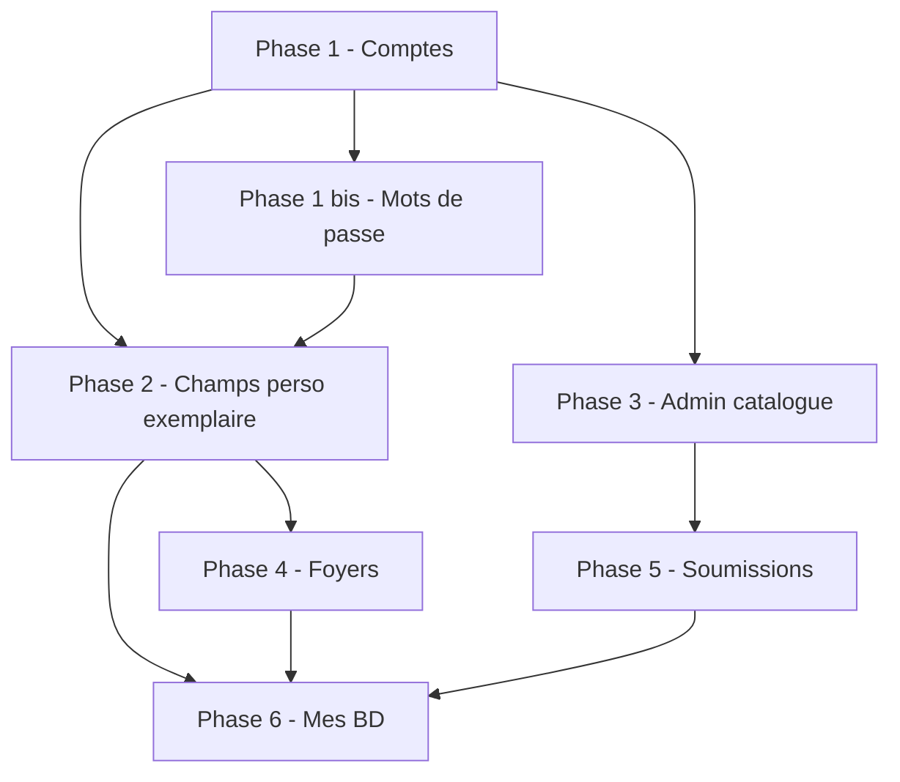

# Roadmap Moncine

Document de planification des **évolutions fonctionnelles** de l’application Moncine (dvdthèque personnelle : films, puis bandes dessinées).

Les phases sont **ordonnées par dépendances** : chaque étape s’appuie sur la précédente. Les changements de base de données passent par des **migrations SQL numérotées**, testées depuis la version précédente.

---

## Vision cible

| Acteur | Capacités |
|--------|-----------|
| **Administrateur** | Gère le catalogue d’œuvres partagé (films, puis BD), valide les propositions, enrichit les fiches via TMDB |
| **Utilisateur** | Gère sa bibliothèque : collection du foyer, **sa** wishlist, **ses** notes et visions |
| **Sous-utilisateur « famille »** | Même collection physique que le foyer ; wishlist et historique **personnels** |
| **Tous** | Ne modifient pas les métadonnées catalogue — seulement les infos de **leur** exemplaire (`support`, format image/son, etc.) |

Fonctionnalités métier visées :

1. Comptes **admin** / **utilisateur** (connexion, gestion admin, changement et réinitialisation de mot de passe)
2. Foyers et sous-comptes **famille**
3. Page **Mes BD** (collection + wishlist)
4. **Soumissions** au catalogue (préremplissage → validation admin)

---

## État actuel

**Version applicative : 0.7.2**

Application PHP + SQLite, déployable en local ou sur un serveur web classique.

### Déjà en place

| Domaine | Contenu |
|---------|---------|
| **Catalogue & bibliothèque** | Tables `oeuvres`, `bibliotheque`, `historique` ; films, envies, import/export CSV |
| **Enrichissement** | TMDB, OMDB, affiches, statistiques, quiz, sagas |
| **Comptes (phase 1)** | Connexion, déconnexion, premier admin, CRUD utilisateurs, rôles, protection des pages |
| **Mots de passe (phase 1 bis)** | Mon compte, changement de mot de passe, oublié par e-mail, reset admin |
| **Exemplaire personnel (phase 2)** | `format_image` / `format_son` sur `bibliotheque` ; formulaire « mon exemplaire » ; enrichissement catalogue réservé admin |
| **Migrations SQL** | `SchemaMigrator`, CLI `php lib/cli/migrate.php`, migrations `001` → `006` |
| **Tests** | PHPUnit sur import/export CSV et maintenance catalogue |

### Prochaines étapes

| Phase | Statut |
|-------|--------|
| Phase 3 — Admin catalogue | ✅ Livré (v0.6) |
| Phase 4 — Foyers & famille | ✅ Livré (v0.7) |
| Phase 5 — Soumissions catalogue | À faire |
| Phase 6 — Mes BD | À faire |

---

## Vue d’ensemble des phases



---

## Stratégie SQL : migrations versionnées

### Suivi du schéma

```sql
schema_migrations (name TEXT PRIMARY KEY, applied_at)

app_metadata (
  key TEXT PRIMARY KEY,
  value TEXT NOT NULL
)
-- Clés : schema_version, …
```

- **`schema_version`** : numéro de la dernière migration appliquée
- **`schema_migrations`** : traçabilité fichier par fichier

### Convention

| Règle | Exemple |
|-------|---------|
| Nom de fichier | `007_admin_audit_log.sql`, `008_foyers.sql` |
| Numéro sur 3 chiffres, croissant | Ne jamais modifier un fichier déjà publié |
| Une responsabilité par fichier | Auth ≠ foyers ≠ BD |
| SQL + commentaire en tête | `-- requires: schema_version >= 6` |
| Données : `INSERT…SELECT` explicite | Pour les transformations de données existantes |

### Schéma cible (après toutes les phases)

```text
oeuvres              -- catalogue partagé (films, BD, …)
bibliotheque         -- lien foyer/user + statut + champs perso exemplaire
historique           -- visions + notes (+ user_id)
utilisateurs         -- comptes (role, foyer_id)
foyers               -- ménage / famille
catalogue_soumissions
schema_migrations
app_metadata
sessions             -- si sessions en base
```

### Outils

| Élément | Rôle |
|---------|------|
| `sql/schema.sql` | Install fraîche (base vide) |
| `sql/migrations/*.sql` | Évolutions incrémentales |
| `php lib/cli/migrate.php` | Appliquer les migrations (dev et production) |

---

## Phase 1 — Comptes, connexion et rôles ✅

**Objectif :** fin du mono-utilisateur ; base pour familles et soumissions.

**Statut : livré** (migration `002_utilisateurs_auth.sql`).

| # | Tâche | Statut |
|---|--------|--------|
| 1.1 | Connexion / déconnexion | ✅ |
| 1.2 | `UserContext` ← session | ✅ |
| 1.3 | Protection pages + menu par rôle | ✅ |
| 1.4 | Assistant premier admin (DB vide) | ✅ |
| 1.5 | CRUD utilisateurs (admin) | ✅ |
| 1.6 | `canManageCatalog()` ← `role` | ✅ |
| 1.7 | Durcissement sécurité (CSRF, limite connexion, hash) | ✅ |

**Critère :** deux comptes → deux bibliothèques distinctes.

---

## Phase 1 bis — Mots de passe ✅

**Objectif :** chaque utilisateur gère son mot de passe ; récupération en cas d’oubli.

**Statut : livré** (migration `004_password_reset_tokens.sql`).

| # | Tâche | Statut |
|---|--------|--------|
| 1 bis.1 | Page Mon compte (profil) | ✅ |
| 1 bis.2 | Changer son mot de passe | ✅ |
| 1 bis.3 | Admin : réinitialiser le mot de passe d’un compte | ✅ |
| 1 bis.4 | Mot de passe oublié (formulaire e-mail) | ✅ |
| 1 bis.5 | Nouveau mot de passe via jeton (expiration, usage unique) | ✅ |
| 1 bis.6 | Envoi e-mail (SMTP ou `mail()`) | ✅ |
| 1 bis.7 | Limite de débit sur « oublié » | ✅ |

### Hors scope court terme

| Idée | Phase suggérée |
|------|----------------|
| Forcer changement au premier login | 1 bis.9 |
| Authentification à deux facteurs (2FA) | Hors périmètre |
| SSO / LDAP | Phase ultérieure (optionnelle) |

---

## Phase 2 — Catalogue vs exemplaire personnel ✅

**Objectif :** séparer les métadonnées catalogue (partagées) des infos de l’exemplaire personnel (support, formats).

**Statut : livré** (migrations `005_format_exemplaire_bibliotheque.sql`, `006_drop_oeuvre_format_columns.sql`).

| # | Tâche | Statut |
|---|--------|--------|
| 2.1 | `format_image`, `format_son` sur `bibliotheque` | ✅ |
| 2.2 | Formulaires utilisateur : champs exemplaire uniquement | ✅ |
| 2.3 | Blocage serveur : pas de modification catalogue par un user | ✅ |
| 2.4 | Enrichissement TMDB réservé admin | ✅ |
| 2.5 | Migration des données existantes | ✅ |

**Critère :** l’utilisateur modifie support/format ; pas le titre catalogue.

---

## Phase 3 — Admin catalogue ✅

**Objectif :** outils de maintenance du catalogue pour les administrateurs.

**Statut : livré** (v0.6.0, migration `007_admin_audit_log.sql`).

| # | Tâche | Statut |
|---|--------|--------|
| 3.1 | Page admin : vue d’ensemble (doublons, fiches incomplètes) | ✅ |
| 3.2 | Fusion de doublons (`oeuvres` → une seule fiche) | ✅ |
| 3.3 | Journal des actions admin sur le catalogue | ✅ |
| 3.4 | Outils de nettoyage (affiches orphelines, doublons TMDB) | ✅ |

Page : `/maintenance-catalogue.php` (menu admin **Maintenance**).

**Critère :** un admin peut détecter et fusionner un doublon sans perte de bibliothèque utilisateur.

---

## Phase 4 — Foyers & famille ✅

**Objectif :** collection partagée au niveau du foyer ; wishlist et historique personnels.

**Statut : livré** (v0.7.0, migrations `008`–`011`, script `FoyerMigration`).

**Dépend de :** phase 2. **Migration la plus délicate** — prévoir sauvegarde avant upgrade.

### Migrations SQL

```text
008_foyers.sql — table foyers, foyer_id sur utilisateurs
009_bibliotheque_foyer_collection.sql — foyer_id sur collection
010_historique_user_id.sql — user_id sur historique
011_wishlist_per_user.sql — contraintes collection (foyer) / envies (user)
```

Script PHP post-SQL : `lib/FoyerMigration.php`.

| # | Tâche | Statut |
|---|--------|--------|
| 4.1 | CRUD foyers (admin) | ✅ |
| 4.2 | Affectation utilisateur → foyer | ✅ |
| 4.3 | Collection visible par tous les membres du foyer | ✅ |
| 4.4 | Wishlist et historique filtrés par `user_id` | ✅ |
| 4.5 | Interface « famille » (sous-comptes, affectation foyer) | ✅ |

Pages : `/foyers.php`, `/utilisateurs.php`, `/mon-compte.php`.

**Critère terminé :** deux membres d’un même foyer voient la même collection ; leurs envies et notes restent séparées.

---

## Phase 5 — Soumissions catalogue

**Objectif :** les utilisateurs proposent de nouvelles œuvres ; l’admin valide avant insertion dans `oeuvres`.

**Dépend de :** phase 3 (recommandé) ou phase 1 (minimum).

### Migrations SQL prévues

```text
012_catalogue_soumissions.sql
  - catalogue_soumissions (user_id, payload JSON, statut, created_at, reviewed_at)
```

| # | Tâche |
|---|--------|
| 5.1 | Formulaire « proposer une œuvre » (préremplissage TMDB optionnel) |
| 5.2 | File d’attente admin (approuver / rejeter / modifier) |
| 5.3 | À l’approbation : création dans `oeuvres` + notification |
| 5.4 | Aucune écriture directe dans `oeuvres` par un utilisateur non admin |

**Critère terminé :** une proposition validée apparaît dans le catalogue ; une rejetée ne laisse aucune trace dans `oeuvres`.

---

## Phase 6 — Mes BD

**Objectif :** gérer les bandes dessinées comme les films (collection, envies, statistiques).

**Dépend de :** phases 2 et 4 (recommandé).

### Migrations SQL prévues

```text
013_oeuvres_bd_metadata.sql
  - champs spécifiques BD sur oeuvres (série, tome, ISBN, …)
  - moncine_kind = 'bd'
```

| # | Tâche |
|---|--------|
| 6.1 | Page Mes BD (collection + wishlist) |
| 6.2 | Formulaires ajout / modification BD |
| 6.3 | Import CSV étendu (format BD) |
| 6.4 | Statistiques et filtres BD |
| 6.5 | Soumissions BD (réutilise phase 5) |

**Critère terminé :** une BD peut être ajoutée, classée en collection ou envie, notée et exportée.

---

## Import / export de données

Fonctionnalité transversale déjà partiellement en place :

| # | Tâche | Statut |
|---|--------|--------|
| I.1 | Export CSV (collection, envies, historique) | ✅ |
| I.2 | Import CSV bibliothèque | ✅ |
| I.3 | Import CSV catalogue (admin) | ✅ |
| I.4 | Export/import affiches (`posters/`) | ✅ |
| I.5 | Documentation utilisateur import/export | À enrichir |

---

## Checklist avant chaque release applicative

1. Numéro de version et `schema_version` cible documentés dans ce fichier
2. Fichiers SQL nouveaux uniquement (ne jamais modifier une migration déjà publiée)
3. Test **install fraîche** (`schema.sql` + toutes les migrations)
4. Test **upgrade** depuis la version précédente sur une base de test
5. Tests PHPUnit (`composer test`)
6. Notes de version : migrations, actions manuelles éventuelles

---

## Décisions techniques

| Sujet | Choix retenu |
|-------|--------------|
| Authentification | Session PHP + `password_hash` |
| Collection foyer | `foyer_id` sur `bibliotheque` (collection) |
| Wishlist | `user_id` personnel |
| BD | Même table `oeuvres`, type `bd` via `moncine_kind` |
| Chemins données | Variable `MONCINE_DATA_PATH` (base, clés API, affiches) |

---

## Hors périmètre (pour plus tard)

- Application mobile native
- Sync multi-instances
- Marketplace entre foyers
- API publique
- Authentification à deux facteurs (2FA)

---

## Suivi de la roadmap

### Historique

- 2026-05-19 — Version **0.7.2** : menu Gestion / Paramètres, navigation entre fiches et pagination catalogue améliorée
- 2026-05-19 — Version **0.7.1** : dépôt d’affiche manuel sur une fiche catalogue (admin)
- 2026-05-16 — Phases **1**, **1 bis** et **2** livrées (comptes, mots de passe, champs exemplaire)
- 2026-05-19 — Roadmap recentrée sur les **fonctionnalités logicielles** ; séparation upstream / packaging externalisée
- 2026-05-19 — Version **0.7.0** : phase **4** (foyers, collection partagée, envies et historique personnels)
- 2026-05-19 — Version **0.6.0** : phase **3** (maintenance catalogue : doublons, fusion, journal, nettoyage affiches)
- 2026-05-19 — Version **0.51.0** : correction création premier compte, mise en page fiches sans affiche

---

## Liens utiles dans le code

| Sujet | Fichiers |
|-------|----------|
| Connexion DB + migrations | `lib/Database.php`, `lib/SchemaMigrator.php` |
| Chemins données | `lib/config.php` (`MONCINE_DATA_PATH`) |
| Utilisateur courant | `lib/UserContext.php`, `lib/FoyerRepository.php` |
| Connexion / session | `lib/Auth.php`, `lib/LoginThrottle.php` |
| Comptes (admin) | `www/utilisateurs.php`, `lib/UtilisateurRepository.php` |
| Mots de passe | `www/mon-compte.php`, `www/mot-de-passe-oublie.php` |
| Format exemplaire | `sql/migrations/005_*.sql`, `lib/CatalogSchema.php` |
| Import / export | `www/import.php`, `www/export.php` |
| Maintenance catalogue | `www/maintenance-catalogue.php`, `lib/CatalogMaintenance.php` |
| Schéma | `sql/schema.sql` |
| CLI migrations | `lib/cli/migrate.php` |

---

*Dernière mise à jour : mai 2026 — document vivant : mettre à jour le statut des phases à chaque livraison.*
